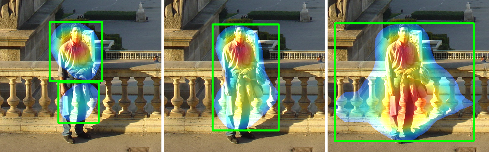
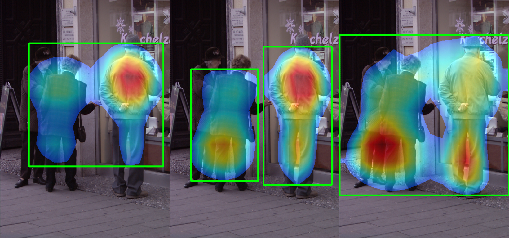
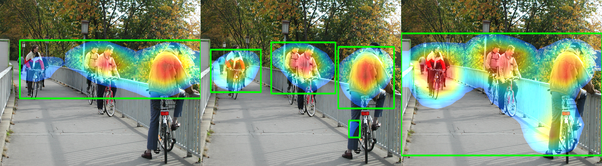

# GSAP-CAM (Global Squared Average Pooling - Class Activation Mapping)

## [CSED441] Introduction to Computer Vision - Final project

### Usage
~~~
#training

THEANO_FLAGS=device=cuda0 python cam.py --train true --weight_path "weights/new/lr-3.nr0.9/"

#vgg pre trained network weights download

wget https://github.com/awentzonline/keras-vgg-buddy/releases/download/0.0.1/vgg16_weights.h5

#testing

THEANO_FLAGS=device=cuda0 python cam.py  --image_path "../INRIAPerson/Test/pos/crop_000001.png" --model_path "weights/new/lr-2.nr0.95/weights.39-0.10.hdf5"

#visualize all

THEANO_FLAGS=device=cuda0 python cam.py --visualize true --model_path "weights/new/lr-3.nr0.9/weights. 39-0.22.hdf5" --output_path "weights/new/lr-3.nr0.95/heatmaps"
~~~

### Result

Global Max Pooling - Global Squared Average Pooling - Global Average Pooling

### Dependency

Keras 1.1.1 with Theano background.

To use Tensorflow, modify every layer to be channel last.